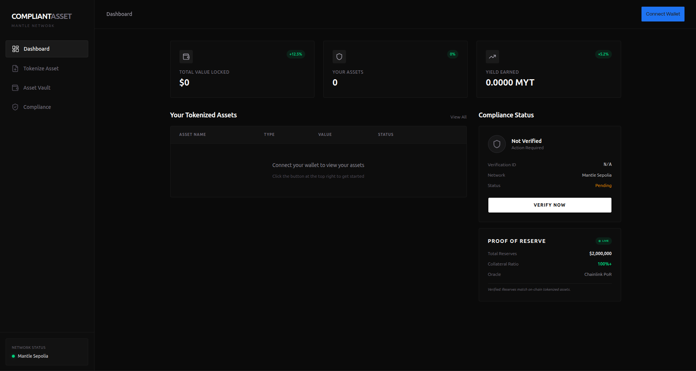

# CompliantAssetVault

**Privacy-focused RWA Tokenization & Yield on Mantle Network**

CompliantAssetVault is a decentralized platform built for the **Mantle Global Hackathon 2025**. It enables users to tokenize real-world assets (RWAs) like invoices and bonds while maintaining privacy through **Zero-Knowledge KYC (ZK-KYC)**.



## Key Features

- **ZK-KYC Verification**: Prove compliance (non-sanctioned, age, etc.) without revealing personal identity using Circom-based ZK-proofs.
- **RWA Tokenization**: Mint ERC-721 tokens representing real-world assets with on-chain regulation flags.
- **Compliant Yield Vault**: Stake tokenized assets in a secure vault to earn yields, accessible only to ZK-verified users.
- **Soulbound Compliance**: Verified users receive a non-transferable KYC Soulbound Token (KYCSBT) for seamless ecosystem access.
- **Premium UI**: A mature, dark-themed dashboard built with Tailwind CSS 4 and Reown AppKit.

## Technical Stack

- **Blockchain**: Mantle Sepolia Testnet
- **Smart Contracts**: Solidity (Hardhat, OpenZeppelin)
- **ZK-Proofs**: Circom, SnarkJS (Groth16)
- **Frontend**: React, TypeScript, Vite, Tailwind CSS 4
- **Web3 Library**: Wagmi, Viem, Reown AppKit (WalletConnect)

## Project Structure

```text
├── circuits/           # ZK-KYC Circom circuits and setup scripts
├── contracts/          # Solidity smart contracts and deployment modules
├── frontend/           # React dashboard and ZK integration
└── README.md           # Project overview
```

## Quick Start

### Prerequisites

- Node.js (v18+)
- Circom (for circuit compilation)
- A Mantle Sepolia wallet with test MNT

### Installation

1.  **Clone the repo**:

    ```bash
    git clone https://github.com/your-repo/mantle-rwa-vault
    cd mantle-rwa-vault
    ```

2.  **Setup Contracts**:

    ```bash
    cd contracts
    npm install
    npx hardhat compile
    ```

3.  **Setup Frontend**:
    ```bash
    cd frontend
    npm install --legacy-peer-deps
    npm run dev
    ```

## � Deployment

### 1. Smart Contracts

1. Navigate to the `contracts` directory and install dependencies:
   ```bash
   cd contracts
   npm install
   ```
2. Configure your environment variables in a `.env` file:
   ```env
   PRIVATE_KEY=your_private_key
   MANTLE_SEPOLIA_RPC=https://rpc.sepolia.mantle.xyz
   ```
3. Deploy to Mantle Sepolia:
   ```bash
   npm run deploy:mantle
   ```
4. Export ABIs to the frontend:
   ```bash
   npm run export-abi
   ```

### 2. ZK Circuits

1. Navigate to the `circuits` directory and run the setup script (requires `circom`):
   ```bash
   cd circuits
   chmod +x setup.sh
   ./setup.sh
   ```
2. Move the generated WASM and ZKey files to `frontend/public/zk/`.

### 3. Testing

Run the comprehensive test suite to verify all smart contract functionality:

1. Navigate to the `contracts` directory:
   ```bash
   cd contracts
   ```
2. Run all tests:
   ```bash
   npm test
   ```
3. Generate coverage report:
   ```bash
   npm run test:coverage
   ```

**Current Test Coverage:**

- ✅ RWA Tokenization (minting with regulation flags)
- ✅ KYC Soulbound Token (non-transferable verification)
- ✅ Vault Access Control (verified users only)
- ✅ Deposit/Withdrawal Operations
- ✅ Dynamic Yield Accumulation
- **6 passing tests** covering core functionality

## Roadmap & Production Readiness

### Why Mock Feeds?

For the hackathon demo on **Mantle Sepolia**, we use `MockPriceFeed` and `MockPoRFeed` contracts. This is because:

1. **Testnet Availability**: Real-world asset feeds (like specific invoice pools or private bond yields) are often not available on public testnets.
2. **Demo Control**: Mock feeds allow us to demonstrate dynamic yield changes and Proof-of-Reserve triggers during a 3-minute pitch.

### Path to Mainnet

1. **Chainlink PoR Integration**: Replace mock feeds with official Chainlink Proof of Reserve feeds for specific RWA partners (e.g., Matrixdock, Backed).
2. **SumSub/Persona API Production**: Transition from simulated ZK-KYC to real-world AML/KYB checks using production API keys.
3. **Chainlink CCIP**: Implement cross-chain transfers to allow Mantle-native RWAs to be utilized across the Ethereum ecosystem.
4. **Security Audits**: Conduct professional audits of the Vault and ZK-Verifier contracts.

## Team

- **[Zacheus Israel]**: Full-stack Developer with years of experience in Web3. Previously built [VieledBatch](https://github.com/zachyo/VeiledBatch).
  - [Twitter](https://twitter.com/zachy_yo) | [LinkedIn](https://linkedin.com/in/zacheusio) | [GitHub](https://github.com/zachyo)
  - **Contact**: [segunzacheusi@gmail.com] | Discord: [donzachy]

## Compliance Declaration

**Regulatory Disclosure Statement**

This project involves the tokenization of **regulated real-world assets**, including but not limited to:

- Commercial invoices and receivables
- Corporate bonds and debt instruments
- Other financial instruments subject to securities regulations

### Compliance Framework

**For Hackathon Demonstration:**

- This is a **proof-of-concept** built for the Mantle Global Hackathon 2025
- Uses **simulated KYC/AML verification** for demonstration purposes
- Deployed on **Mantle Sepolia Testnet** with mock oracle feeds
- **No real financial instruments** are tokenized or traded

**Production Compliance Roadmap:**

1. **KYC/AML Integration**: Full integration with licensed providers (SumSub, Persona) for real-world identity verification
2. **Regulatory Licensing**: Obtain necessary licenses for RWA tokenization in target jurisdictions
3. **Chainlink Proof of Reserve**: Replace mock feeds with production-grade oracle attestations
4. **Legal Structure**: Establish SPV (Special Purpose Vehicle) entities for asset custody
5. **Security Audits**: Professional smart contract audits by firms like OpenZeppelin, Trail of Bits, or Certora
6. **Jurisdictional Compliance**: Ensure compliance with:
   - SEC regulations (US) for securities tokenization
   - MiCA framework (EU) for crypto-asset regulation
   - Local AML/CFT requirements in operating jurisdictions

### Privacy & Data Protection

- **Zero-Knowledge Proofs**: User identity data is **never stored on-chain**
- **GDPR Compliance**: Off-chain KYC data handling follows data protection regulations
- **Selective Disclosure**: Only compliance status (verified/not verified) is revealed publicly
- **Soulbound Tokens**: Non-transferable verification credentials prevent identity trading

### Risk Disclosure

Users should be aware that:

- Smart contracts carry inherent risks including bugs and exploits
- RWA tokenization is subject to evolving regulatory frameworks
- This demonstration uses mock data and should not be used for real asset management
- Always conduct due diligence before interacting with production deployments

**For questions regarding compliance, contact**: [segunzacheusi@gmail.com]

## Documentation

- **[PITCH.md](./PITCH.md)**: Business model, problem/solution, and roadmap.

## License

This project is licensed under the MIT License.
